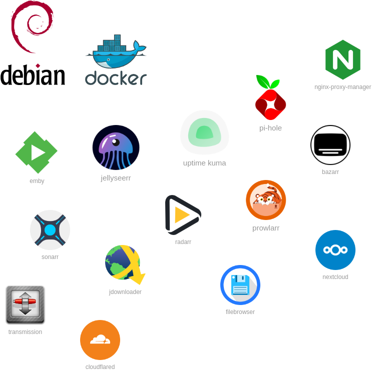

# Home server docker services

The definitive services for your home server.



## TL;DR

```
chmod +x install.sh
./install.sh hsds-cli
hsds setup quiet
```

## Requirements
Any Debian based linux distribution.

## How to install
Just run the install command. It ll install docker and all dependencies to run the services.

```bash
chmod +x install.sh
./install.sh hsds-cli
```

## Usage
inside the `_archive` folder are the services.
just move the folder of the services that you want to run 1 level up

```
.
├── README.md
├── install.sh
└── _archive
    ├── bazarr
    │   ├── docker-compose.yml
    │   └── readme.md
    └── twingate
        └── docker-compose.yml
```

on this example twingate will be installed.
```
.
├── README.md
├── install.sh
├── _archive
│   └── bazarr
│       ├── docker-compose.yml
│       └── readme.md
└── twingate
    ├── docker-compose.yml
    └── readme.md
```
---

```
hsds   shx@dev  2025-03-02
---------------------------
Home Server Docker Services
hsds-cli v4.0.0
---------------------------

Usage: hsds {destroy | stop | pull | setup | clean | update | parallel | help}
Example: hsds setup

Options:
 - destroy: Destroy the Docker images ( docker compose down )
 - stop: Stop the Docker images ( docker compose stop )
 - pull: Pull the Docker images ( docker compose pull )
 - setup: Setup the Docker images ( docker compose up -d )
 - list: List the Docker images ( docker ps )
 - clean: Clean the system 
 - update: Update hsds-cli
 - pull-parallel: Pull Docker images in parallel
 - help: Display help
 - uninstall: uninstall hsds-cli

Optional parameters:
 - quiet: Install requirements and containers without confirmation
Example: hsds setup quiet
```
## Services Available

| Service | Description |
|--|--|
| [bazarr](_archive/bazarr/readme.md) | Tool for manage subtitles on your media server. |
| [cloudflared](_archive/cloudflared/readme.md) | Used to expose services through a ZTNA network. |
| [compress-&-encrypt]("#") | bash script that generate a `.zip` file (optional encrypt) |
| [deluge]("https://deluge-torrent.org/") | Torrent client |
| [docmost]("https://docmost.com/") |  Used for taking notes. Very similar to Notion but open source. |
| [doplarr]("https://github.com/kiranshila/Doplarr") |  |
| [duckdns]("https://www.duckdns.org/") | Free DNS service. |
| [duplicati]("#") | backup tool |
| [emby]("#") | The best app for watch stream (in my opinion). It integrates with Jellyseerr, Sonarr, and Radarr. |
| [filebrowser]("#") | A simple HTTP file share that allows users to upload their files. |
| [gitlab]("#") |  |
| [homarr]("#") |  |
| [homepage]("#") | A simple dashboard for easy access to your services. |
| [immich]("#") | Photo & Gallery backup/sync tool |
| [jdownloader2]("#") | An HTTP downloader that supports multiple file hosting services. |
| [jellyfin]("#") |  |
| [jellyseerr]("#") | Used to request new movies and TV shows. It integrates with Emby, Sonarr, and Radarr. |
| [kopia]("#") |  |
| [uptime-kuma]("#") | Used to monitor the health of your services. |
| [lidarr]("#") | used to download audio from Prowlarr |
| [metube]("#") | Used to download youtuve videos / playlists / audios |
| [nextcloud]("#") | Open-source cloud storage, similar to Google Drive. |
| [ngnix-proxy-manager]("#") |  |
| [noip]("#") |  |
| [owncloud]("#") |  |
| [pi-hole]("#") |  |
| [portainer]("#") | used to manage docker from browser |
| [Prowlarr]("#") | Used to index torrent websites. |
| [pterodactyl]("#") |  |
| [qbittorrent]("#") |  |
| [radarr]("#") | Used to download movies from Prowlarr. |
| [romm]("#") |  |
| [seafile]("#") |  |
| [sonarr]("#") | Used to download TV shows from Prowlarr. |
| [Speedtest-tracker]("#") | Monitors your internet speed. |
| [steam-csgo]("#") |  |
| [steam-project-zomboid]("#") |  |
| [steam-rust]("#") |  |
| [steam-valheim]("#") |  |
| [stirling-tools]("#") | Similar to I Love PDF. |
| [syncthing]("#") | Tool to sync files across multiple computers |
| [tdarr]("#") |  |
| [traefik]("#") | another proxy manager. |
| [Transmission]("#") | A lightweight torrent client. |
| [tubesync]("#") | Tool used to sync youtube public playlists. |
| [twingate]("#") | A ZTNA service for accessing your home server remotely. |

## Other Services

| Service | Description |
|--|--|
| [nginx-proxy-manager]("#") | A highly recommended proxy manager. |
